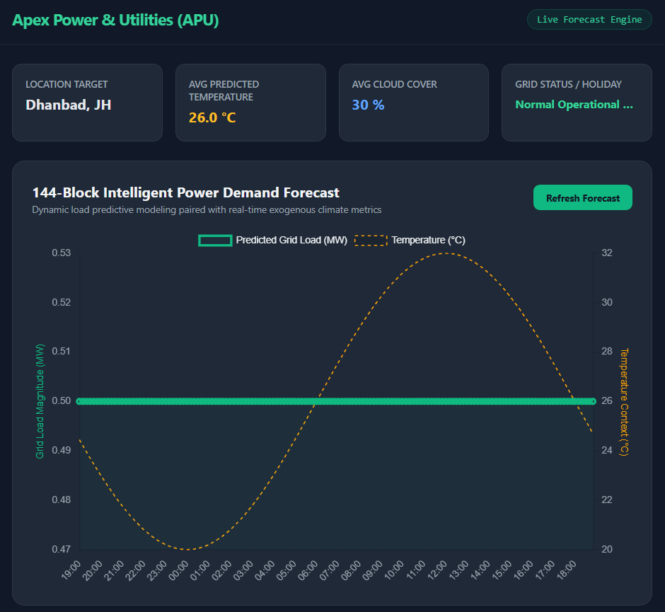

# Apex Power & Utilities (APU) - Intelligent Power Demand Forecasting Prototype

An end-to-end machine learning pipeline and containerized dashboard application designed to forecast electricity demand for Apex Power & Utilities (APU) in 10-minute blocks (144 blocks/day). 

This solution addresses real-world data issues (gaps, sensor errors, outliers), integrates historical weather data from public APIs for Dhanbad, Jharkhand, and tracks specific localized regional holidays to ensure highly accurate operational grid predictions.

---

## 📊 Dashboard Preview

---

## 🏗️ Repository Architecture

<pre>
apex-power-forecasting/
├── backend/
│   ├── main.py                # FastAPI Service Endpoints
│   └── model.pkl              # Serialized XGBoost Model Artifact
├── frontend/
│   ├── index.html             # Single-Page Dashboard Interface Layout
│   └── script.js              # Chart.js Controller & API Fetching Logic
├── notebooks/
│   └── demand_forecasting_eda.ipynb  # Complete Data Cleaning, EDA & Training Notebook
├── Dockerfile                 # Single Container Packaging Script
├── requirements.txt           # Python Project Dependencies
└── README.md                  # Implementation Manual
</pre>
  
---

## 🚀 Local Deployment Setup

### 1. Initialize Virtual Environment & System Core

Open your terminal in the root directory and run these setup scripts:

<pre>
# Create and activate an isolated python environment
python -m venv venv
.\venv\Scripts\Activate.ps1
source venv/bin/activate

# Install strict system dependencies
pip install -r requirements.txt
</pre>

### 2. Launch the High-Performance Backend API

<pre>
python backend/main.py
</pre>

* The live production API server will start on http://localhost:8000.
* Explore full automated OpenAPI documentation at http://localhost:8000/docs.

### 3. Serve the Real-Time Frontend UI Dashboard

To prevent browser CORS or file-system protocol blocks, serve the interface folder through a localized Python server. Open a secondary terminal tab and run:

<pre>
cd frontend
python -m http.server 5500
</pre>

* Open your browser and navigate to: http://localhost:5500/index.html

---

## 🐳 Docker Containerization Deployment

To deploy the entire production stack inside an isolated, platform-agnostic container environment, execute the following commands from the root directory:

<pre>
# 1. Build the production Docker image layers
docker build -t apu-forecasting-app .

# 2. Run the container instance mapped to port 8000
docker run -d -p 8000:8000 --name apu-grid-engine apu-forecasting-app
</pre>

---

## 🛠️ Core Engineering & Model Architecture Justification

### 1. Data Cleaning & Robust Preprocessing Pipeline

* Outlier Filtering: Implemented a rolling local Z-score tracking calculation to identify and drop noisy sensor spikes without distorting broader macroeconomic usage trends.
* Intelligent Imputation: Gaps and empty historical segments are systematically reconstructed using a data-driven time-of-day/day-of-week grouping map, maintaining structural seasonality.

### 2. Feature Engineering Matrix

* Exogenous Metrics: Captured thermal momentum trends using localized temperature, humidity, and cloud cover structures mapped to Dhanbad coordinates.
* Temporal Patterns: Modeled day-to-day cyclic variations using Sine and Cosine coordinate transforms alongside historical multi-step lag values (Lag 1, 2, and 144) to capture rolling load memory.

### 3. Machine Learning Model Selection Justification

This architecture utilizes a fine-tuned XGBoost Regressor pipeline. Decision tree gradient boosting frameworks offer exceptional resistance to multi-collinearity, manage mixed-scale continuous features without demanding heavy computational scaling parameters, and maintain a highly lightweight runtime layout optimized for strict, low-overhead container environments.
